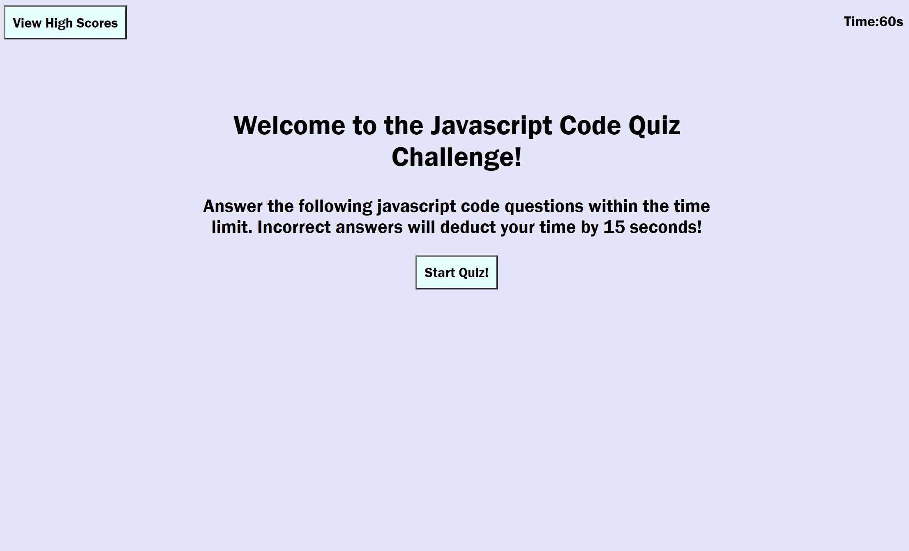

# Code-Quiz-Time
A simple Timed JavaScript Code Quiz

# Mission

My mission on this assignment was to create a simple timed code quiz on JavaScript fundamentals that stores high scores so that I can gauge my progress compared to my peers.

# Process

Again, I was lucky that my instructor, and TA went over the beginning parts with the class and guided me on how to start and how the flow of my code would be most effective. As advised, although still unfamiliar, I started with my pseudo code on what my end game would accomplish. Then right after class, I had a tutoring session who also talked over what additional things that I should look at, add or reference to. 

I believed my TA for stating that this was his favorite and a really fun assignment. HOWEVER, I found this one to be the MOST challenging yet. 

Despite my previous assignments, the process of functions was still something getting used to. Things still don't click right away and it takes me some time to organize my thoughts. From where to start, how to get it working, and how to link various parts to work as one flowing unit.

Per the advice of my instructor, I had to think of how my user would utilize this. It starts with the beginning welcome page which includes the all the buttons and the timer. Once I had a functioning timer, my flow led me to the start button and what that would initiate. My quiz questions, answer choices, results and highscores all tied towards the end.

Another great lesson I learned was to start as soon as possible as the bugs you encounter will try to break you mentally. I discovered that little things I added or changed had effected the code when it should not have. I'm honestly still scratching my head on some parts on why on earth that happened. But once you get started with debugging and you continue to tackle it relentlessly, your reward is a fully functioning code along with a stiff back and sore tailbone.  

# Finished!

I give complete credit to my instructor, TA and tutor and their never-ending patience and willingness to pull me out of the well. As frustrating this was, it was also a good lesson that I just need to continue getting acquainted with all of this. "All you need is time". -My wonderful instructor.

# Have a Look See

# [See It For Yourself Here](https://jlee3883.github.io/Code-Quiz-Time/) ❤️️

